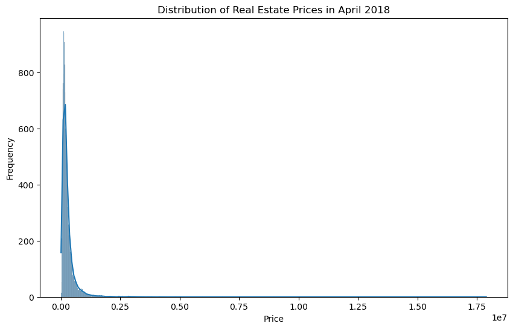
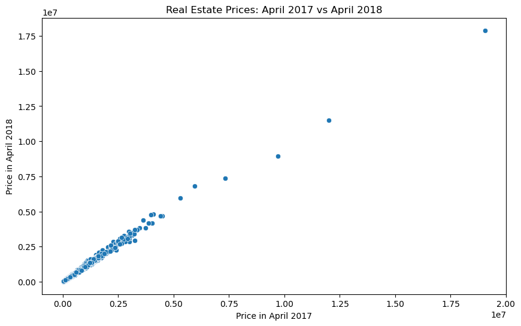
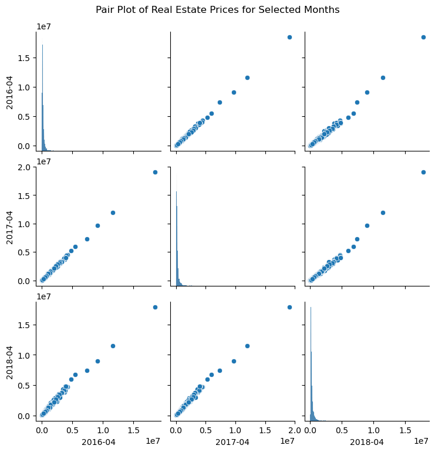

# **Predicting Future Housing Markets with Zillow's Data**

## **Business Understanding**

**Overview/Background Information**

A real estate company is on a mission to find the hottest zip codes to invest in. They've got historical housing data from Zillow, like a time capsule, and they'll use it to predict future price trends. By analyzing this data, they want to pinpoint the top 5 zip codes with the most promising investment potential.

**Problem Statement**

Create a data-based recommendation for the top 5 zip codes the real estate investment firm should focus on, considering future price trends, risk factors, and the firm's investment timeframe.

**Objectives**

1. Build a model to predict future real estate prices for different zip codes.

2. Review the predictions by looking at profit potential, risk, and how long to hold the investment.

3. Suggest the top 5 zip codes for investment based on these factors.

**Challenges**

1. Determining the "optimal" investment requires balancing the potential for profit (expected price appreciation), risk tolerance (price instability), and investment duration (holding period).

2. Real estate prices are influenced by factors beyond past data, including economic conditions, local development projects, and interest rates.

3. Time series models have limitations; they cannot ensure accurate predictions, and future market behavior is inherently uncertain.

**Proposed Solution: Metrics of Success**

To address these challenges, we propose the following approach:

1. Apply time series forecasting to the provided historical Zillow data to predict future real estate prices across different zip codes.

2. Analyze the forecasts by evaluating the profit potential, which is the expected price increase in each zip code; the risk, which involves the historical price volatility in each zip code; and the investment horizon, which refers to the planned duration of holding the investment.

3. Prioritizing investment opportunities involves analyzing forecasted prices, profit potential, and risk to identify the top 5 most promising zip codes for real estate investment.

**Conclusion**

We'll predict future real estate prices and look at how much money can be made and how risky each area is. This will help us recommend the 5 best zip codes to invest in. How well we do depends on how good our predictions are and how carefully we consider everything.

## **Data Understanding**

Our data is a csv file and it contains 14,723 rows and 272 columns.
The dataset contains the following columns:

- RegionID: Unique identifier for the region.
- RegionName: Zip code of the region.
- City: City name.
- State: State abbreviation.
- Metro: Metro area.
- CountyName: County name.
- SizeRank: Rank by size.
- Date columns (from 1996-04 to 2018-04): Real estate prices for each month in this period.

The data types are as follows:
1. 49 columns are of type int64 (mostly identifiers).

2. 219 columns are of type float64 (real estate prices).

3. 4 columns are of type object (text data: City, State, Metro, CountyName).

## **Data Preparation and Analysis**

 Before data cleaning,the plot indicates that there are significant outliers in the real estate prices for each month, suggesting the presence of extreme high values. The distribution of prices is relatively consistent over time, with a positive skewness indicating more high-value outliers.

 After cleaning the data, the plot indicates that the data cleaning process has removed all outliers, resulting in an empty plot. This suggests that the z-score threshold might need to be adjusted to retain more data points while still removing extreme outliers.

 In the process we check for missing values and find that the total missing values in the dataset is 157934.We then implement a method to fill missing values with the median of each column and the resulting total missing values in the dataset is 0

 **Exploratory data analysis(EDA)**

 Exploratory Data Analysis involves the following;

1. Univariate Analysis: The analysis of individual variables to understand their distribution and summary statistics.

2. Bivariate Analysis: The analysis between two variables.

3. Multivariate Analysis: The analysis among three or more variables.

So for our case we are going to use Univariate, Bivariate and multivariate analysis.

**Univariate Analysis**

Overall, the plot shows the distribution of real estate prices in April 2018, with a large number of lower-priced properties and a small number of high-priced outliers.

**Bivariate Analysis**

The scatter plot visualizes the relationship between real estate prices in April 2017 and April 2018.The plot shows that real estate prices in April 2017 are a good predictor of prices in April 2018, with a consistent upward trend and a few high-value outliers

**Multivariate Analysis**

The pair plot visualizes the relationships between real estate prices in three selected months: April 2016, April 2017, and April 2018.the pair plot shows the strong positive correlations and linear relationships between real estate prices in April 2016, April 2017, and April 2018, along with the presence of high-value outliers and the right-skewed distribution of prices.

