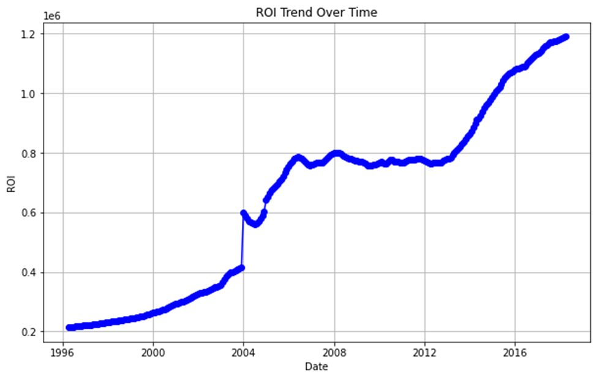
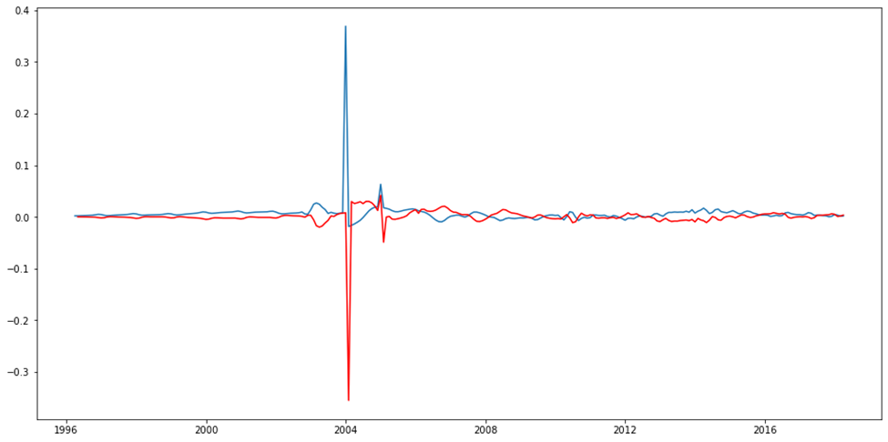
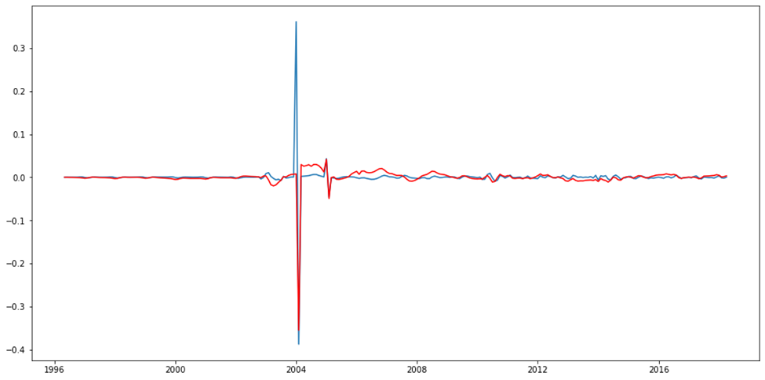

# **Predicting Future Housing Markets with Zillow's Data**

## **Business Understanding**

**Overview/Background Information**

A real estate company is on a mission to find the hottest zip codes to invest in. They've got historical housing data from Zillow, like a time capsule, and they'll use it to predict future price trends. 98

## **Data Understanding**

Our data is a csv file and it contains 14,723 rows and 272 columns.
The dataset contains the following columns:

- RegionID: Unique identifier for the region.
- RegionName: Zip code of the region.
- City: City name.
- State: State abbreviation.
- Metro: Metro area.
- CountyName: County name.
- SizeRank: Rank by size.
- Date columns (from 1996-04 to 2018-04): Real estate prices for each month in this period.

The data types are as follows:
1. 49 columns are of type int64 (mostly identifiers).

2. 219 columns are of type float64 (real estate prices).

3. 4 columns are of type object (text data: City, State, Metro, CountyName).

Statistical Summary:

- There's a clear upward trend in real estate prices. The average price in 1996 was around 118,299 in dollars , and by 2018, it had risen to 288,039 in dollars.

- Prices vary a lot between zip codes, showing the different types of real estate markets in each area.

## **Data Preparation and Analysis**

 We're going to create a function that reads our data and gives us an overall view of it.

 From this we can see the various aggregate statistics and we can also see that our data has house prices for various regions from April 1996 to April 2018 we also note that the RegionName column represents the various zipcodes. So we'll appropriately rename the column.

 We then look into Return on Investment for various cities, since we would like to recommend only the best options for our stakeholders and the outcome is that the best states to invest in is definitely New York. So we'll focus on this city for our project.

 **Exploratory data analysis(EDA)**

 Exploratory Data Analysis involves the following;

1. Univariate Analysis: The analysis of individual variables to understand their distribution and summary statistics.

2. Bivariate Analysis: The analysis between two variables.

3. Multivariate Analysis: The analysis among three or more variables.

So for our case we are going to use Univariate we only have 1 column of data against.

**Univariate Analysis**

From this plot we can see
- Overall Trend:
The ROI values show a clear upward trend over time. This indicates consistent growth in ROI from 1996 to 2018.

- Periods of Rapid Growth:
There are several periods where the ROI increases sharply, such as around the years 2004 and in 2014. These periods of rapid growth could be attributed to various economic factors.

- Plateaus and Stabilization:
Between approximately 2008 and 2013, the ROI appears to stabilize with minor fluctuations. This could suggest a period of market stabilization or maturity.

- Overall Volatility:
The general trend appears smooth, with a few notable spikes or drops. This suggests that while there is growth, the ROI experiences periods of volatility which could be due to market conditions or specific events impacting the ROI.

- Seasonality or Cyclical Patterns:
There doesn't seem to be a clear cyclical or seasonal pattern from the plot, but further analysis might be needed to confirm this.

## **Modelling**

We build a model that helps our investors in determining future prices of houses in New York. NY has the best returns and that is why we want to help investors get the best return for their investments and value for money.

The Model we are going to build is ARIMA and try and tune it to get the best predictions for future prices.
From the auto correlation function and partial auto correlation functions determined above, the best p, d, q arrangement is (12, 1, and 12).

This is how our model is fitting into the data, the red is the prediction from the model while the light blue one is the actual values.

These plots typically compare the residuals of a fitted model to those of the original time series.

Residuals at higher lags appear randomly distributed and small, resembling white noise.

Both models seem to handle higher lags well, with residuals appearing random and small, suggesting they are well-fitted for those lags.

**RECOMMENDATIONS**

For the base model the ARIMA captured the upward trend in predicting the values but for better performance we recommend to use a grid search or auto ARIMA to get better performance by selecting the best parameters.

**FURTHER STEPS**

1.	.Implement grid search or auto ARIMA: Using grid search or auto ARIMA to find optimal parameters (p,d,q) could improve model performance. This would help fine-tune the model beyond the initial (10, 0, 10) configuration.
2.	Validate model assumptions: Check if the residuals of the ARIMA model meet key assumptions like normality and no autocorrelation. This can be done using diagnostic plots and statistical tests.
3.	Perform out-of-sample forecasting: Split the data into training and test sets to evaluate how well the model performs on unseen data. This will give a better indication of its predictive power.

**CONCLUSION**

The ARIMA model has proven to be a powerful tool for forecasting real estate prices. However, it is crucial to continuously monitor the market and update the model with new data to maintain its accuracy. By leveraging these predictions, investors can make informed decisions and maximize their returns in the dynamic real estate market.

